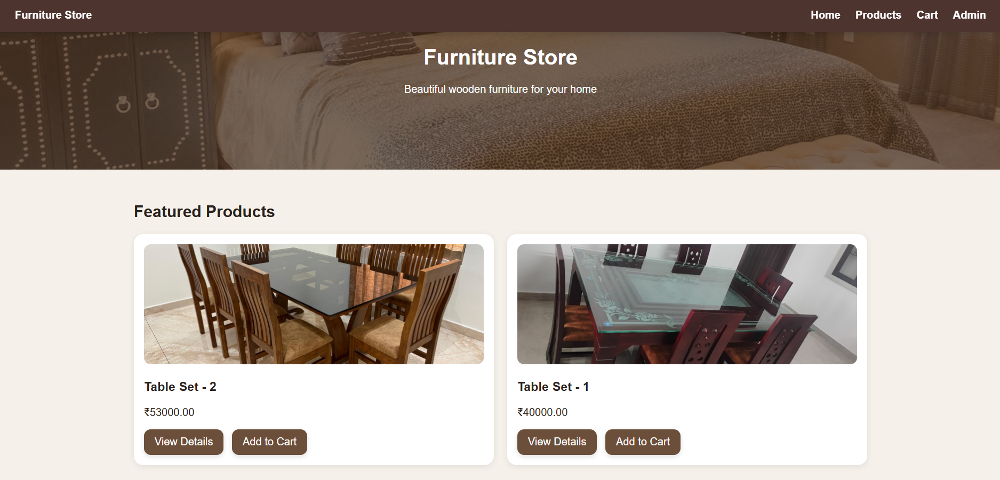
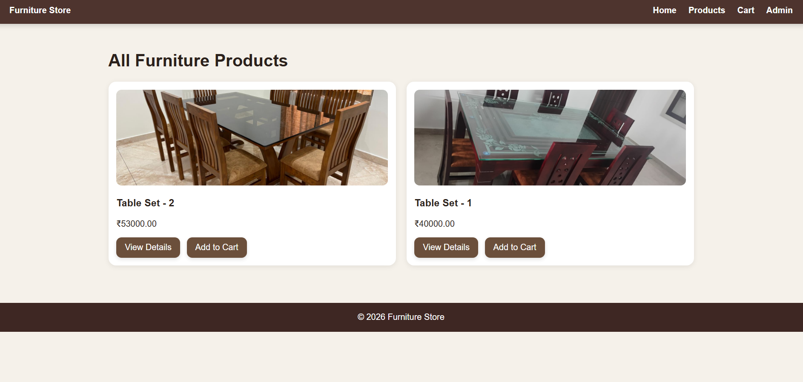
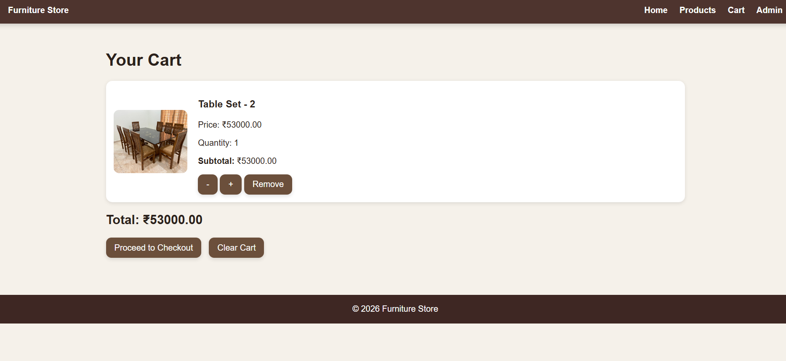
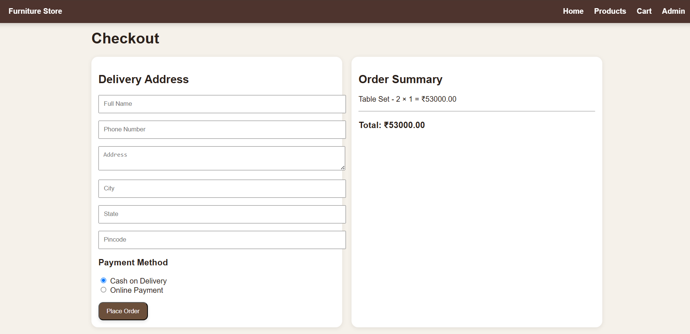

# 🪑 Furniture Store - Django E-Commerce Website


A modern full-stack Furniture Store web application built using **Django**. The application allows users to browse furniture products, view detailed product information, add products to a shopping cart, place orders using Cash on Delivery (COD), and manage products through the Django Admin Panel.

This project demonstrates full-stack web development concepts including authentication, CRUD operations, session management, media handling, and responsive UI design.

---

## 📌 Features

### 👤 User Features
- User Registration & Login
- Browse Furniture Products
- Product Detail Page
- Shopping Cart
- Quantity Management
- Cash on Delivery (COD) Checkout
- Order Confirmation
- Order History
- Responsive Design

### 🛠 Admin Features
- Django Admin Dashboard
- Add Products
- Update Products
- Delete Products
- Upload Product Images
- Manage Orders
- Manage Users

---

# 🖼 Screenshots

## Home Page



---

## Products Page



---

## Shopping Cart



---

## Checkout



---

## 🚀 Tech Stack

### Backend
- Python
- Django

### Frontend
- HTML5
- CSS3
- JavaScript
- Bootstrap

### Database
- SQLite3

### Tools
- Git
- GitHub
- VS Code

### Libraries
- Pillow

---

# 📂 Project Structure

```
Furniture_Store/
│
├── accounts/
├── cart/
├── orders/
├── pages/
├── products/
│
├── templates/
├── static/
├── media/
├── screenshots/
│
├── db.sqlite3
├── manage.py
├── requirements.txt
└── README.md
```

---

# ⚙ Installation

## 1 Clone Repository

```bash
git clone https://github.com/YOUR_USERNAME/Furniture-Store-Django.git
```

---

## 2 Navigate into Project

```bash
cd Furniture-Store-Django
```

---

## 3 Create Virtual Environment

Windows

```bash
python -m venv djvenv
```

Activate

```bash
djvenv\Scripts\activate
```

---

## 4 Install Dependencies

```bash
pip install -r requirements.txt
```

---

## 5 Apply Migrations

```bash
python manage.py migrate
```

---

## 6 Create Superuser

```bash
python manage.py createsuperuser
```

---

## 7 Run Development Server

```bash
python manage.py runserver
```

Open

```
http://127.0.0.1:8000/
```

---

# 🔐 Admin Panel

Visit

```
http://127.0.0.1:8000/admin/
```

Login using your superuser credentials.

---

# 💡 Future Improvements

- ✅ Razorpay Payment Gateway
- ❤️ Wishlist
- ⭐ Product Ratings & Reviews
- 🔍 Product Search
- 🏷 Product Categories
- 🎯 Product Filters
- 🖼 Multiple Images per Product
- 📦 Inventory Management
- 📧 Email Notifications
- 📱 Better Mobile Responsiveness
- 🚀 Deployment on Render

---

# 📚 Concepts Covered

- Django Models
- Django Views
- URL Routing
- Template Inheritance
- User Authentication
- Sessions
- CRUD Operations
- Static Files
- Media Files
- Forms
- Bootstrap UI
- Django Admin
- Image Upload
- Git & GitHub

---

# 🎯 Learning Outcomes

Through this project, I learned how to:

- Build a complete Django web application
- Design relational database models
- Implement user authentication
- Manage media and static files
- Build reusable templates
- Perform CRUD operations
- Manage shopping cart using sessions
- Create responsive user interfaces
- Use Git and GitHub for version control

---

# 👨‍💻 Author

**Deepak C R**

Artificial Intelligence & Data Science Graduate

GitHub: https://github.com/deepakcr07

LinkedIn: https://linkedin.com/in/deepak-cr88

---

# ⭐ Support

If you found this project useful, consider giving it a ⭐ on GitHub.

It motivates me to build more projects.
